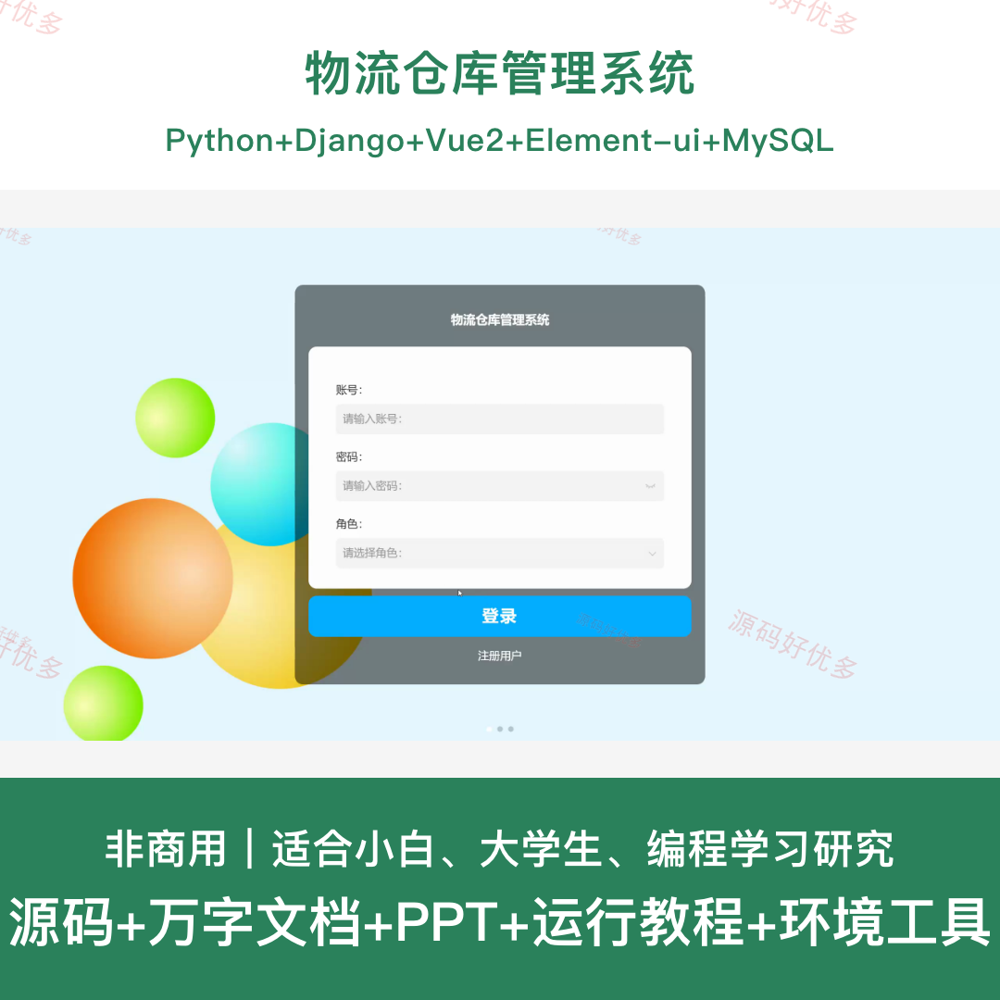
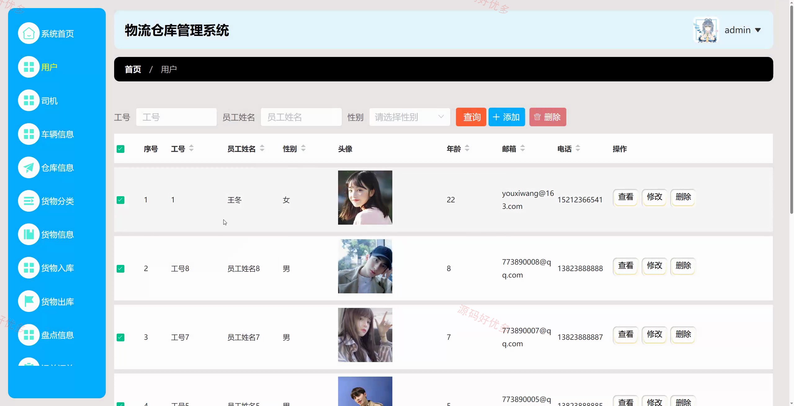
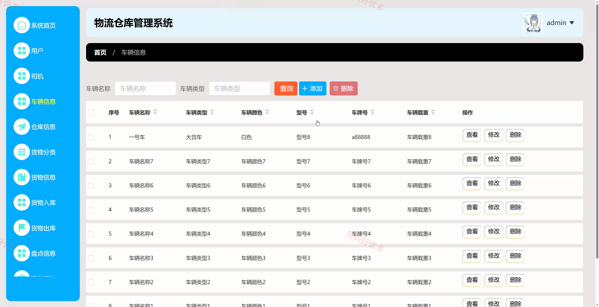
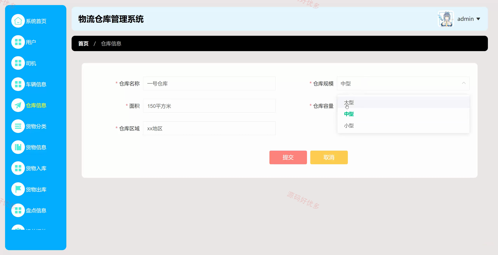
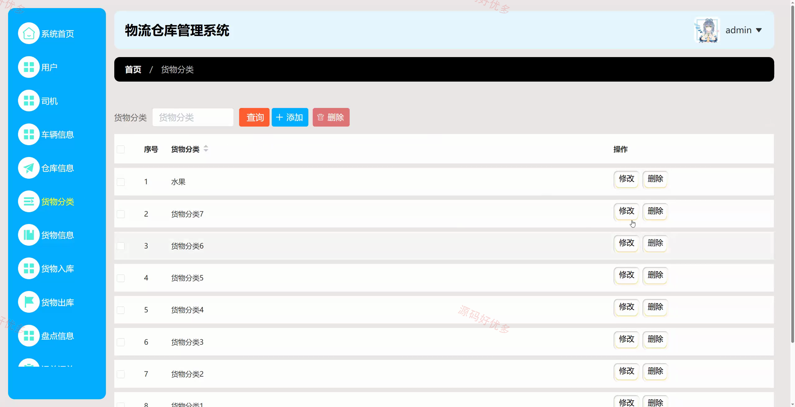
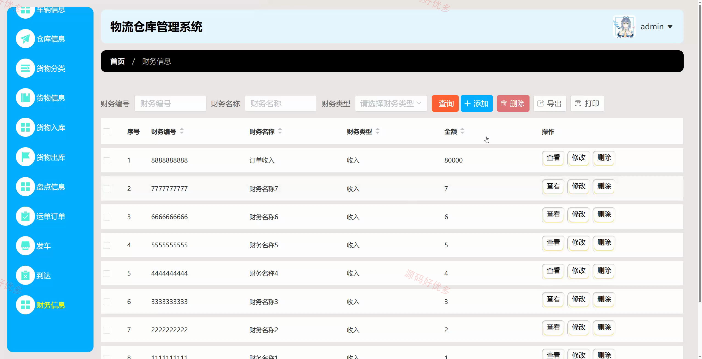
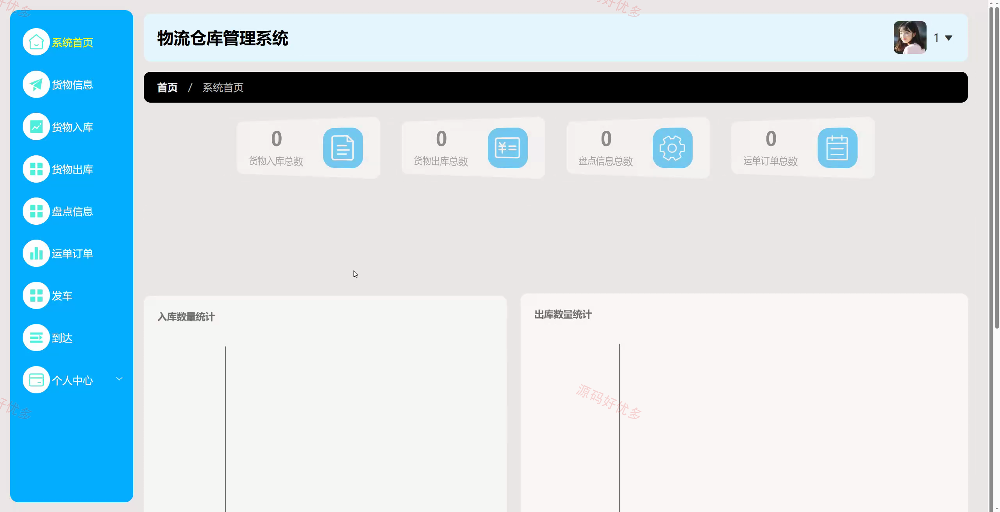
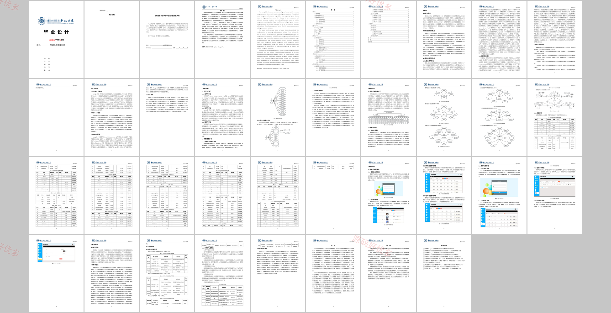

# python132D
物流仓库管理系统
## 源码问题查看主页咨询

### 一、关键词
物流仓库管理系统、仓库信息管理、货物入库出库、库存盘点、运单发车

### 二、作品包含
源码+数据库+万字设计文档+PPT+全套环境和工具资源+本地部署教程

### 三、项目技术
前端技术： Html、Css、Js、Vue2.6、Element-ui
后端技术：Python、Django

### 四、运行环境（以下版本亲测，其他版本兼容性请自行测试）
开发工具：PyCharm + VSCODE

数据库：MySQL5.7+（共15张表）

数据库管理工具：Navicat10以上版本

环境配置软件： Python3.8+

前端Nodejs：14+

浏览器：谷歌浏览器

### 五、项目介绍
项目编号：python132D

物流仓库管理系统面向仓储库存和物流运单管理场景，提供仓库信息、货物分类、货物信息、入库出库、库存盘点、车辆司机、运单订单、发车到达记录、财务收支和基础配置等功能，便于管理员与库存管理员完成仓储物流业务管理。

角色：管理员、库存管理员

用户功能：库存管理员登录、维护仓库货物、办理入库出库、库存盘点、运单发车、到达记录、车辆司机和财务信息查看。

管理员功能：管理员登录、库存管理员管理、仓库信息管理、货物分类与货物信息管理、车辆司机管理、运单订单管理、财务信息和系统配置管理。

### 六、运行截图

